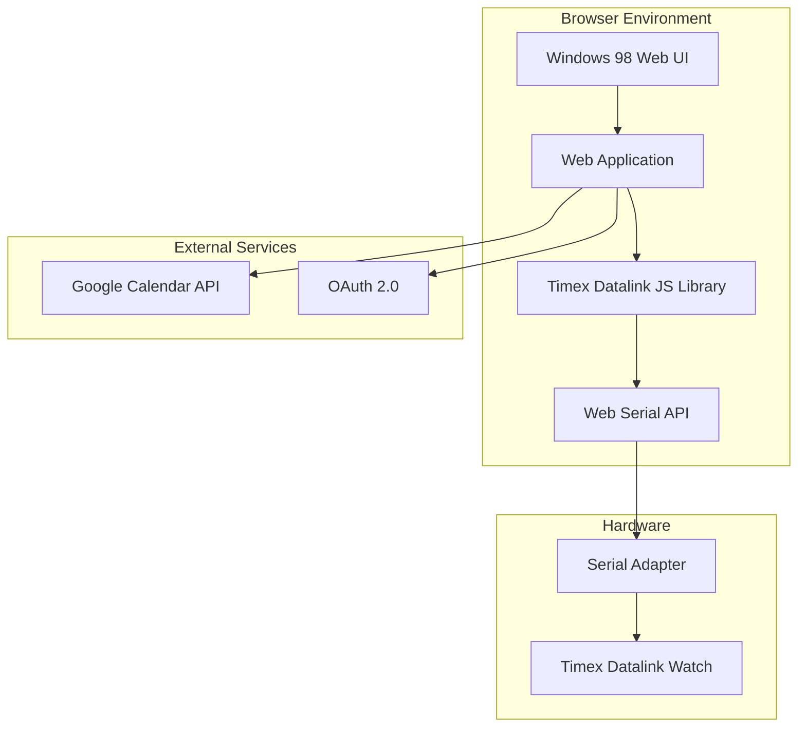
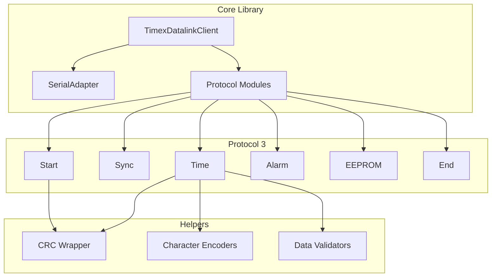

# Design Document

## Overview

The Timex Datalink Web Client will be a JavaScript-based port of the existing Ruby library, combined with a retro-styled web application. The system consists of two main components: a protocol library that handles device communication via Web Serial API, and a Windows 98-styled web interface for user interaction and modern service integration.

The architecture preserves the Ruby library's modular protocol-based design while adapting it for browser environments. Protocol 3 will be implemented first as the foundation, with the web application providing both device management and Google Calendar integration.

## Architecture

### High-Level Architecture



### Library Architecture

The JavaScript library will mirror the Ruby structure with these key adaptations:



## Components and Interfaces

### 1. Core Library Components

#### TimexDatalinkClient Class
```javascript
class TimexDatalinkClient {
  constructor({
    serialPort = null,
    models = [],
    byteSleep = 25,
    packetSleep = 250,
    verbose = false
  })
  
  async write()
  async read() // New bidirectional capability
  packets()
}
```

#### SerialAdapter Class
```javascript
class SerialAdapter {
  constructor({ port, byteSleep, packetSleep, verbose })
  
  async connect()
  async disconnect()
  async write(packets)
  async read() // New for bidirectional communication
  isConnected()
}
```

### 2. Protocol 3 Components

#### Protocol3.Start
- Maintains CPACKET_START constant `[0x20, 0x00, 0x00, 0x03]`
- Implements CRC packet wrapping
- Returns packet arrays for transmission

#### Protocol3.Time
- Validates zone (1-2), date format, and time values
- Implements character encoding for timezone names
- Compiles time data into protocol-specific byte format
- Supports both 12h/24h time formats

#### Protocol3.Sync
- Manages synchronization sequences with configurable length
- Implements ping, sync1 (0x55), and sync2 (0xaa) byte patterns
- Provides timing control for reliable communication

### 3. Helper Modules

#### CrcPacketsWrapper
```javascript
class CrcPacketsWrapper {
  static wrapPackets(packets) {
    return packets.map(packet => [
      ...this.crcHeader(packet),
      ...packet,
      ...this.crcFooter(packet)
    ]);
  }
  
  static crcHeader(packet) {
    return [packet.length + 3];
  }
  
  static crcFooter(packet) {
    // CRC16-ARC implementation
  }
}
```

#### CharacterEncoders
```javascript
class CharacterEncoders {
  static CHARS = "0123456789abcdefghijklmnopqrstuvwxyz !\"#$%&'()*+,-./:\\;=@?_|<>[]";
  
  static charsFor(stringChars, { charMap = this.CHARS, length = null, pad = false }) {
    // Character encoding logic
  }
  
  static eepromCharsFor(stringChars, length = 31) {
    // EEPROM-specific encoding with terminator
  }
}
```

### 4. Web Application Components

#### Device Connection Manager
- Web Serial API integration
- Device discovery and connection handling
- Connection status monitoring
- Error handling and user feedback

#### Windows 98 UI Framework
- CSS-based Windows 98 styling system
- Component library (buttons, dialogs, windows)
- Retro fonts and color schemes
- Responsive layout maintaining authentic look

#### Google Calendar Integration
- OAuth 2.0 authentication flow
- Calendar API data fetching
- Event-to-appointment conversion
- Sync scheduling and status tracking

## Data Models

### Watch Data Structures

#### Time Configuration
```javascript
class TimeConfig {
  constructor({
    zone,           // 1-2
    is24h,          // boolean
    dateFormat,     // string format
    time,           // Date object
    name            // 3-char timezone name
  })
}
```

#### Alarm Data
```javascript
class AlarmData {
  constructor({
    number,         // alarm slot number
    time,           // Date object
    enabled,        // boolean
    message         // optional message
  })
}
```

#### Calendar Event Mapping
```javascript
class CalendarEvent {
  constructor({
    title,          // event title
    startTime,      // Date object
    endTime,        // Date object
    description     // optional description
  })
  
  toWatchAppointment() {
    // Convert to watch-compatible format
  }
}
```

### Protocol Data Packets

All protocol data maintains byte-level compatibility with Ruby implementation:

- **Start Packet**: `[0x20, 0x00, 0x00, 0x03]` with CRC wrapping
- **Time Packet**: `[0x32, zone, sec, hour, min, month, day, year, ...name, wday, is24h, dateFormat]`
- **Sync Packet**: `[0x78, ...sync1Bytes, ...sync2Bytes]`

## Error Handling

### Serial Communication Errors
- Connection timeout handling
- Device not found scenarios
- Permission denied (user cancellation)
- Data transmission errors with retry logic

### Data Validation Errors
- Invalid time/date values
- Character encoding failures
- Protocol-specific constraint violations
- Memory limit exceeded on watch

### Web API Errors
- Google Calendar authentication failures
- Network connectivity issues
- Rate limiting and quota management
- CORS and security policy handling

## Testing Strategy

### Unit Testing
- Protocol packet generation verification
- Character encoding accuracy
- CRC calculation correctness
- Data validation logic

### Integration Testing
- Web Serial API mock testing
- End-to-end protocol communication
- Google Calendar API integration
- Cross-browser compatibility

### Hardware Testing
- Real device communication verification
- Timing parameter optimization
- Protocol 3 feature completeness
- Bidirectional sync validation

### Browser Compatibility Testing
- Chrome/Edge Web Serial API support
- Firefox experimental flag testing
- Safari compatibility assessment
- Mobile browser limitations

## Security Considerations

### Web Serial API Security
- User permission requirements
- Device access restrictions
- Secure connection handling

### OAuth Integration
- Secure token storage
- PKCE flow implementation
- Scope limitation (calendar read-only)
- Token refresh handling

### Data Privacy
- Local data storage only
- No server-side data transmission
- Clear privacy policy for calendar access
- User control over data sync

## Performance Considerations

### Serial Communication Timing
- Configurable byte and packet sleep intervals
- Optimal timing for reliable transmission
- Adaptive timing based on device response

### Memory Management
- Efficient packet compilation
- Minimal DOM manipulation for UI updates
- Calendar data caching strategies

### User Experience
- Progressive loading of calendar data
- Background sync operations
- Responsive UI during device communication
- Clear progress indicators

## Browser Compatibility

### Web Serial API Support
- **Chrome 89+**: Full support
- **Edge 89+**: Full support  
- **Firefox**: Behind experimental flag
- **Safari**: Not supported (alternative approaches needed)

### Fallback Strategies
- Clear messaging for unsupported browsers
- Progressive enhancement approach
- Potential WebUSB fallback investigation
- Documentation for browser setup

## Deployment Architecture

### Static Web Application
- Single-page application architecture
- No server-side requirements
- CDN-friendly static assets
- Local storage for user preferences

### Development Environment
- ES6 modules for clean architecture
- No build tools initially (following POC guidelines)
- Browser-native development workflow
- Simple file structure for rapid iteration